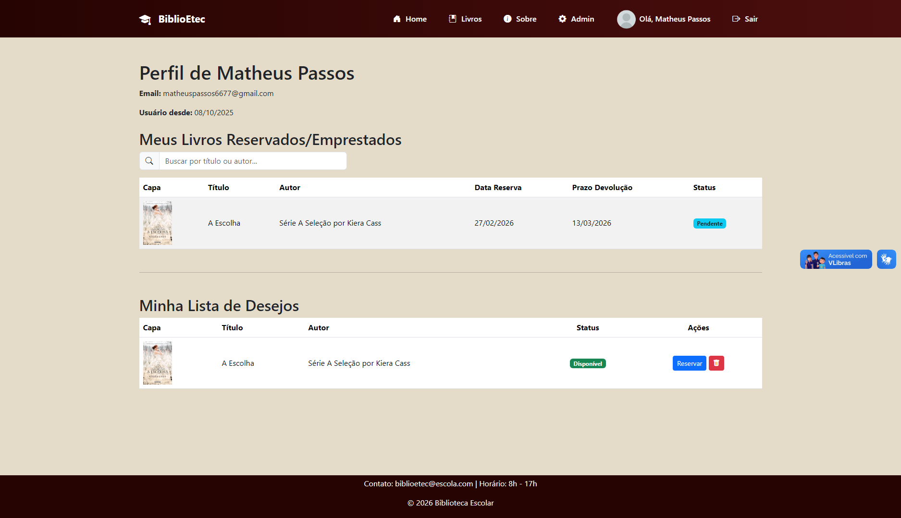
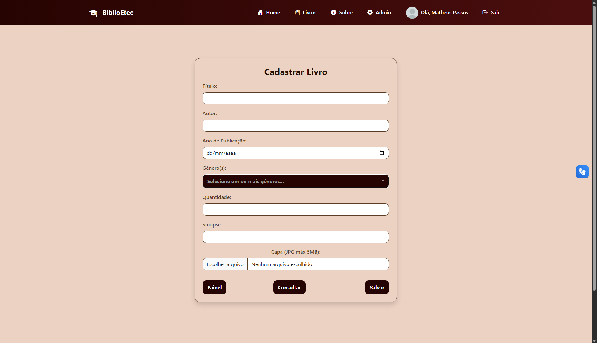

# BiblioEtec-TCC

# 📚 BiblioETEC

> **Sistema moderno de gestão de acervos e bibliotecas escolares.**

O **BiblioETEC** é uma plataforma completa desenvolvida para facilitar a organização de bibliotecas e o acesso à leitura. O projeto combina uma interface amigável para os alunos com um painel administrativo robusto para a gestão de exemplares e reservas.

---

## 🖼️ Visual do Projeto

### 🏠 Home e Catálogo
A página inicial apresenta os destaques do acervo com um design limpo e intuitivo, permitindo que os alunos explorem novas leituras facilmente.

*Interface principal com carrossel e livros em destaque.*

*Sistema de busca e filtragem de obras por título, autor ou gênero.*

---

## 🚀 Funcionalidades Principais

### Para o Aluno 🎓
* **Consulta de Acervo:** Navegação por categorias e busca detalhada.
* **Reserva Online:** Possibilidade de verificar detalhes do livro e realizar reservas através de um modal informativo.
* **Perfil Personalizado:** Painel onde o aluno acompanha seus empréstimos pendentes, prazos de devolução e sua lista de desejos.

  
  

### Para a Administração ⚙️
* **Painel Administrativo:** Central de controle para gerenciamento de privilégios e ações do sistema.
* **Gestão de Exemplares:** Interface dedicada para cadastro de novos títulos com upload de capas e informações detalhadas.
* **Controle de Reservas:** Ferramentas para gerenciar e excluir reservas conforme a disponibilidade.

  
  

---

## 🛠️ Tecnologias Utilizadas

Este projeto foi construído utilizando as melhores práticas de desenvolvimento web:

* **Back-end:** PHP (79.2%) para lógica de negócio e autenticação.
* **Front-end:** CSS3 (20.8%), HTML5 e JavaScript para uma interface responsiva.
* **Banco de Dados:** MySQL para armazenamento de usuários, acervo e logs.
* **Acessibilidade:** Integração com a ferramenta VLibras.

---

## 📂 Organização do Repositório

* **/Screenshots:** Prints das principais telas do sistema.
* **/TCC-BiblioETEC-Final:** Código-fonte completo do projeto.
* **/MODELO_APRESENTACAO_TCC.pptx:** Documentação visual utilizada na defesa do projeto.

---

## 👨‍💻 Desenvolvedor

Projeto desenvolvido pelo nosso grupo  como Trabalho de Conclusão de Curso (TCC).

