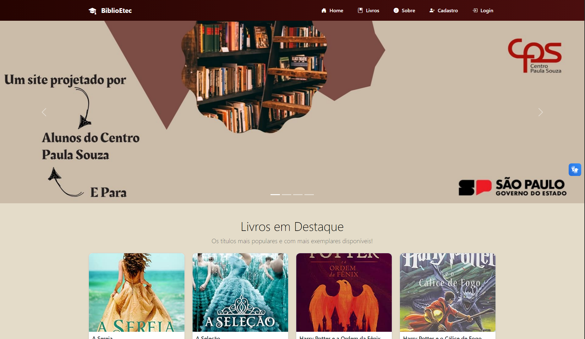
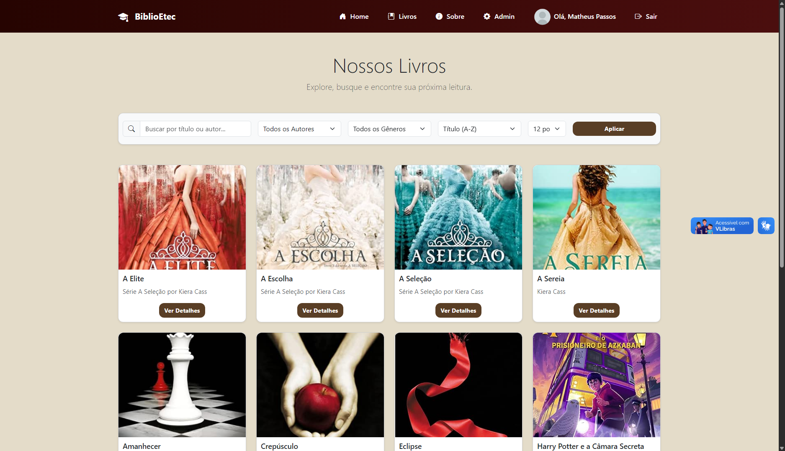
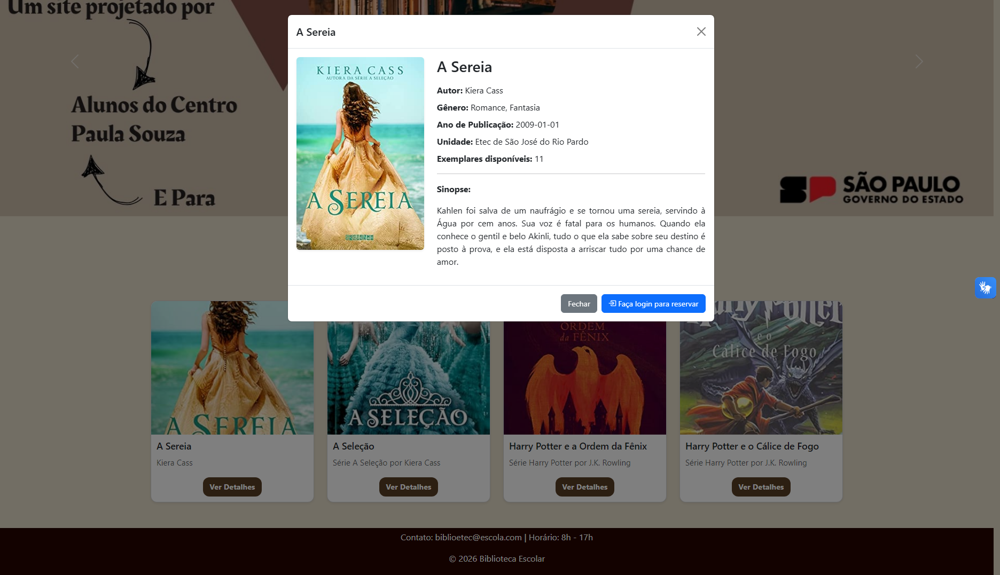
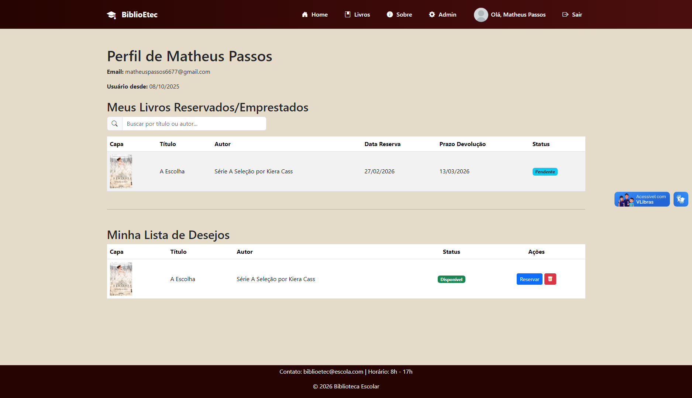
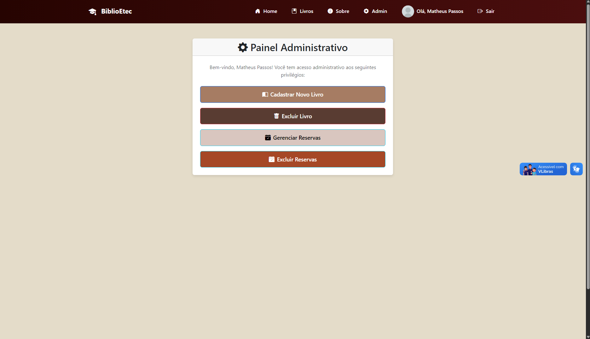
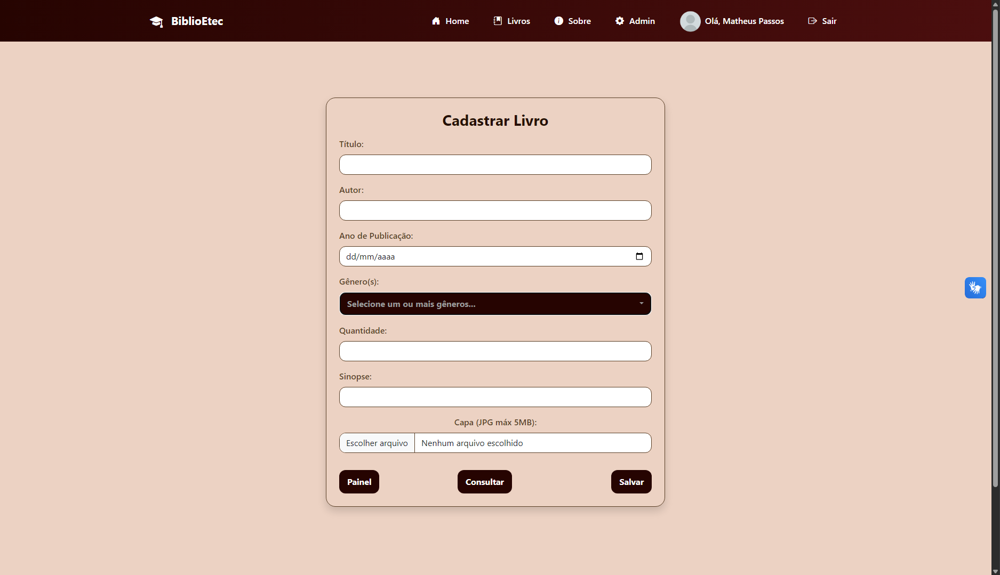

# 📚 BiblioETEC

> **Sistema moderno de gestão de acervos e bibliotecas escolares.**

O **BiblioETEC** é uma plataforma completa desenvolvida para facilitar a organização de bibliotecas e o acesso à leitura. O projeto combina uma interface intuitiva e moderna para os alunos com um painel administrativo cheio de funções para a gestão de exemplares e reservas.

---

## 🖼️ Visual do Projeto

### 🏠 Home e Catálogo
A página inicial oferece uma alta praticidade e combinação de elementos em harmonia,  que facilita a leitura e a localização dos acervos

*Interface principal com carrossel e livros em destaque.*

*Sistema de busca e filtragem de obras por título, autor ou gênero.*

---

## 🚀 Funcionalidades Principais

### Para o Aluno 🎓
* **Consulta de Acervo:** Navegação por categorias e buscas detalhadas com filtragem refinada
* **Reserva Online:** Possibilidade de verificar detalhes do livro e realizar reservas através de um modal informativo.
* **Perfil Personalizado:** Painel onde o aluno acompanha seus empréstimos pendentes, prazos de devolução e sua lista de desejos.

  
  

### Para a Administração ⚙️
* **Painel Administrativo:** Central de controle para gerenciamento de privilégios e ações do sistema.
* **Gestão de Exemplares:** Interface dedicada para cadastro de novos títulos com upload de capas e informações detalhadas.
* **Controle de Reservas:** Ferramentas para gerenciar e excluir reservas conforme a disponibilidade.

  
  

---

## 🛠️ Tecnologias Utilizadas

o projeto foi construído utilizando as melhores práticas de desenvolvimento web:

* **Back-end:** PHP (79.2%) para lógica de negócio e autenticação.
* **Front-end:** CSS3 (20.8%), HTML5 e JavaScript para uma interface responsiva.
* **Banco de Dados:** MySQL para armazenamento de usuários, acervo e logs.
* **Acessibilidade:** Integração com a ferramenta VLibras.

---

## 📂 Organização do Repositório

* **/Screenshots:** Prints das principais telas do sistema.
* **/TCC-BiblioETEC-Final:** Código-fonte completo do projeto.
* **/MODELO_APRESENTACAO_TCC.pptx:** Documentação visual, relatórios de pesquisas e informações técnicas do projeto.

---

## 👨‍💻 Desenvolvedor

Projeto desenvolvido pelo nosso grupo como Trabalho de Conclusão de Curso (TCC).

## Controle de Versão (GIT E GITHUB)
o controle de versão e o processo de lapidagem do projeto teve como pilar o git e o gihub, embora o repositório original foi privado por motivos de segurança de dados e integridade dos membros, o controle de versão teve um papel muito grande no auxílio do nosso projeto, entre commits e merges nosso gerencionamento ficou cada vez mais profissional e aprimorado.

